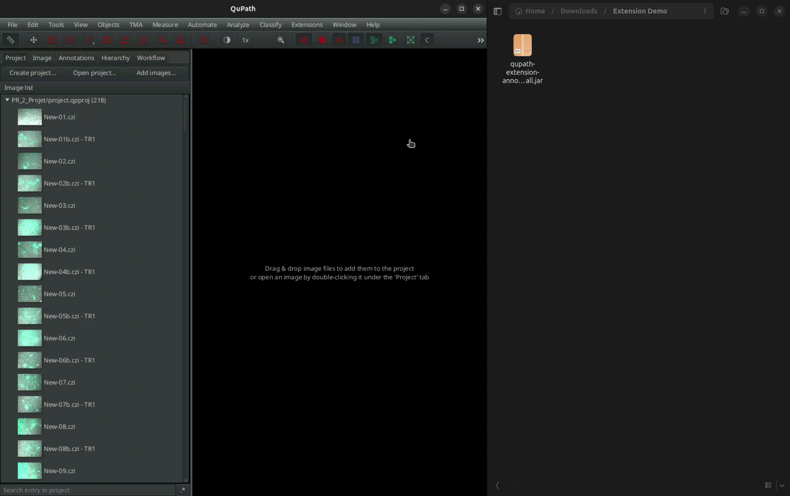
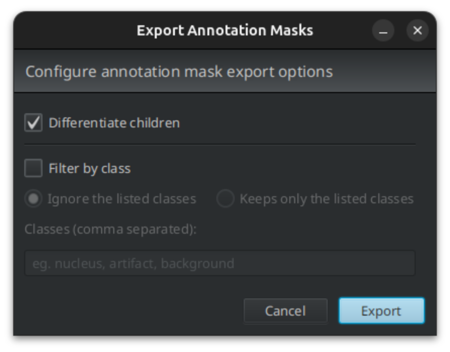
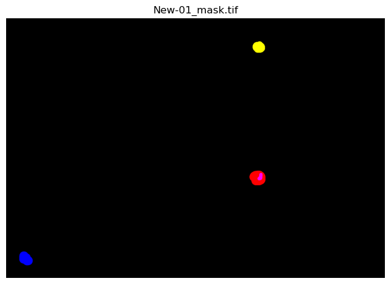
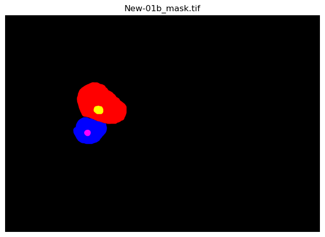
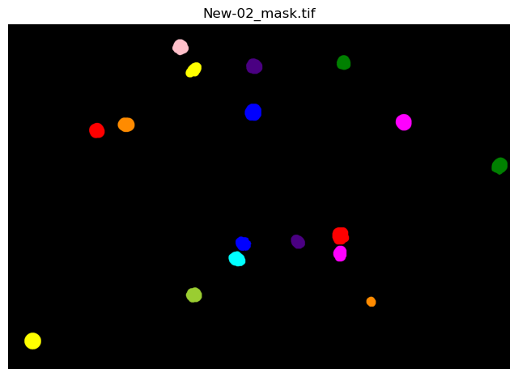
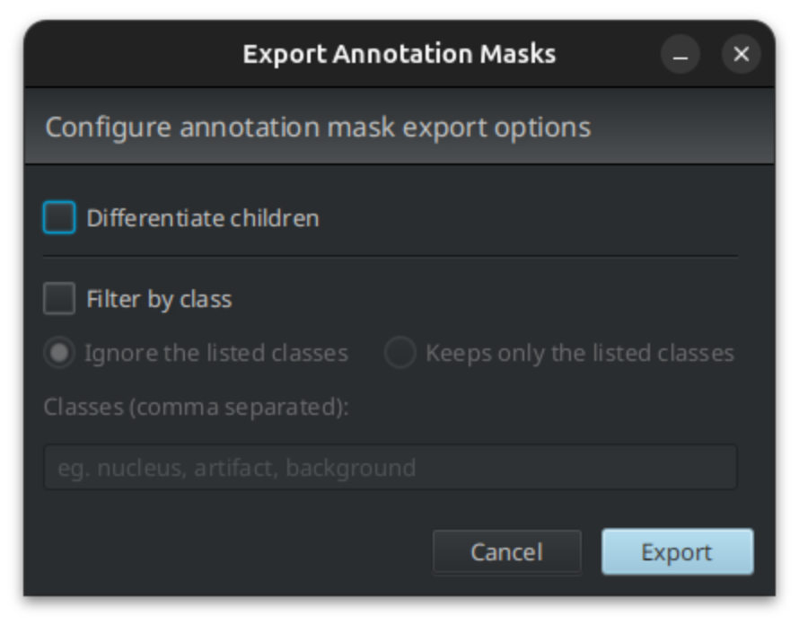
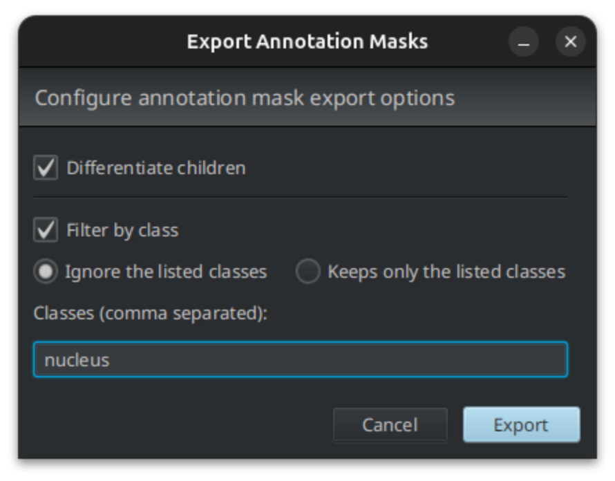
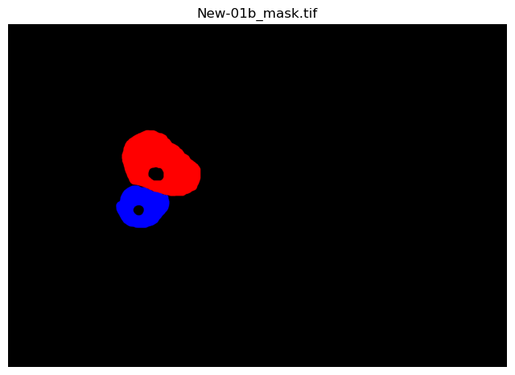
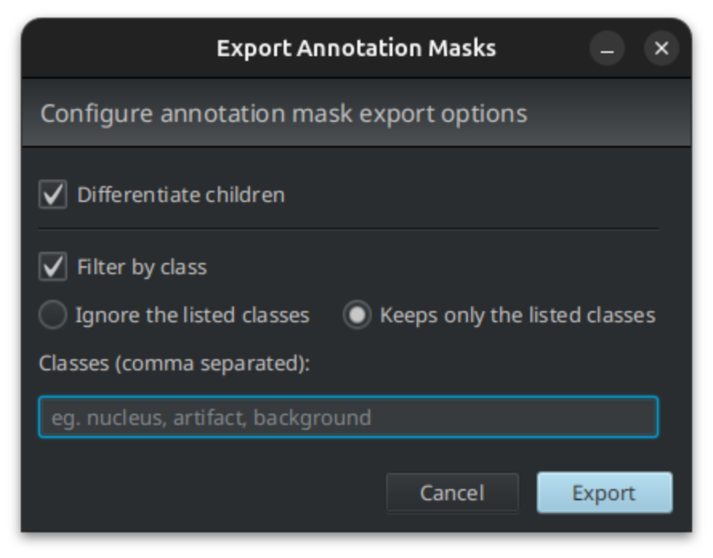
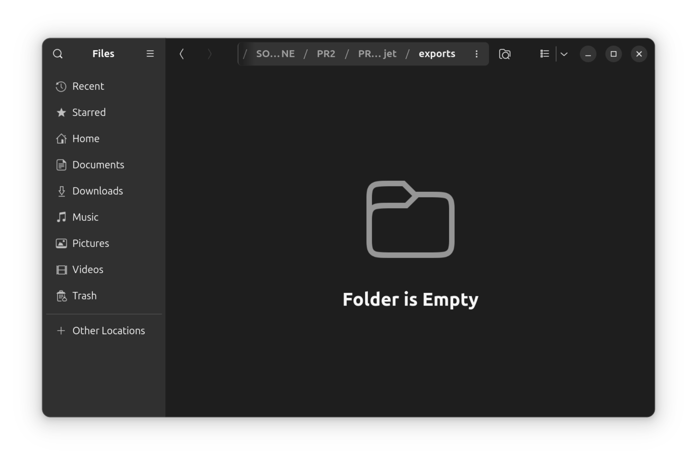

# Annotation Exporter

This QuPath extension aims to provide a simple and efficient way to extract cell annotaions
from [QuPath](https://qupath.github.io) to use for model training and running stats.

## Download the extension
To download the extension you just need to navigate to the [Releases](https://github.com/Luxi99/qupath-extension-annotation-exporter/releases)
section of this repository choose the version you'd like to download (the latest is always recommended)
and download the `.jar` file.

## Build the extension

If instead of downloading a precompiled `.jar`, you want to build the extension yourself you should follow the next steps.

Building the extension with Gradle should be pretty easy - you don't even need to install Gradle separately, because the
[Gradle Wrapper](https://docs.gradle.org/current/userguide/gradle_wrapper.html) will take care of that.

Since this extension depends on external libraries beyond what QuPath already includes such as [export-annotations-core](https://github.com/Luxi99/annotation-exporter-core),
the source code is compiled into a "fat" `.jar` contatining all said libraries. 
To replicate that use:
```bash
./gradlew shadowJar
```

If instead you decide to build the extension without external dependencies use:
```bash
./gradlew build
```

However, if you do that, you'll need to drag *all* the extra dependences onto QuPath to install them as well. 
Otherwise, the extension *will not* work properly.

The built extension should be found inside `build/libs`.

## Install the extension
To install the extension, you simply need to drag its `.jar` onto QuPath to install it, like this:

<p align="center">
  
</p>

At the time of writing, the QuPath version that this extension is intended for is 0.7.0 and developed in Java 25.  
For more information about installing extensions, follow [this](https://qupath.readthedocs.io/en/0.7/docs/intro/extensions.html#installing-extensions-manually) link.  
For more information on how QuPath extensions work, follow [this](https://github.com/qupath/qupath-extension-template) one instead.

## Usage
> The extension is found under the Extensions menu in QuPath.

> All results of the export are saved in the `exports` folder inside the project folder.

In the following paragraphs we'll go through different scenarios on how to use the extension and
what the generated images should look like. The TSV tables are quite self-explanatory 
(just take a look at one, and you'll see what I mean).

### Default configuration
The first time you run the extension, a dialog window will pop up and should look something like this:
<p align="center">
  
</p>

From here on out the combination of selected checks and radio buttons will be called *configuration* 
(config for short).  
If you then run the export with the default configuration, these are the kind of images you should get:

<p align="center">
  
  
  
</p>

> **NOTE**: Nuclei *will* have different labels than their parent cell in this case.  

> **Also notice** that masks are colored: this is not the default behavior, in fact, the image returned by the extension 
> is a grayscale image where each mask is filled with a value ranging from 1 to 65,535 (the image is 16-bit grayscale).
> Here the masks are colored for visualization purposes. So in reality, for images with a dozen of annotations
> you should get what appears to be a black image.

### No differentiation configuration
This config is useful if you want children to be labeled as their parent cell.

> **NOTE**: By children I mean annotations that are fully contained within another annotation. Consequently,
> the latter is considered their parent. Some examples of children annotations might be
> nuclei annotations, mitochondria annotations, etc.

<p align="center">
  
  
</p>

Compare this mask to the second one from the previous section. You'll be able to appreciate
the difference, it being that the nuclei are now labeled as their parent cell.

### "Donut" configuration
This config is useful if you want children annotations to leave a hole inside the parent.

<p align="center">
  
  
</p>

### Empty configuration
This config is not very useful, but hopefully it will give you an idea on how the extension works:
if you `Filter by class` > `"Keeps only"` and leave the `Classes` field empty, no annotation will be
exported and consequently no mask image.

<p align="center">
  
  
</p>

## Future developments
With this being a university project, the roadmap for the future is pretty short. However, if enough people
want to use this extension, and enough interest is shown, these will be possible future updates for
the extension:

- TSV table contents choice → Being able to choose what content to include in the TSV table.
- Custom saving path → Being able to choose where to save the TSV table and the masks.
- Multichannel masks → Being able to export masks with multiple channels. (Cell ch., Nuclei ch., etc.)
- Colored mask export → Being able to export masks with colors for visualization purposes.

## License

Licensed under [GPL-3.0](LICENSE), the same license used by QuPath and its
official extensions. See the [LICENSE](LICENSE) file for full details.